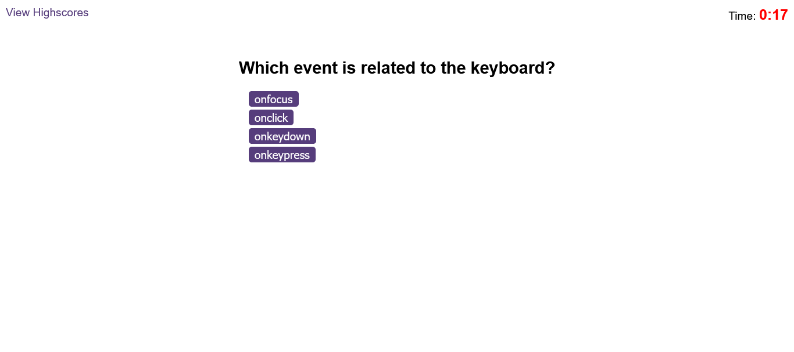
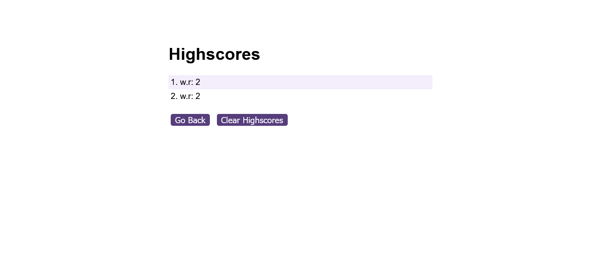

# Module 6 Challenge Web APIs: Code Quiz

##  Task
The Task was to create a quiz with the criteria below

## Acceptance Criteria

Create a code quiz that contains the following requirements:

* A start button that when clicked a timer starts and the first question appears.
 
  * Questions contain buttons for each answer.
  * 
  * When answer is clicked, the next question appears
  * 
  * If the answer clicked was incorrect then subtract time from the clock

* The quiz should end when all questions are answered or the timer reaches 0.

  * When the game ends, it should display their score and give the user the ability to save their initials and their score
  
## Functionality
The user clicks the answer to the quiz, a sound plays to indicate if the answer is correct/not.

Once the time runs out or once the user finishes the questions, they are requested to submit their scores which are then added to the highcores page and they are redirected to view the score of all the players.

##Deployed link
Visit [Code Quiz](https://gloal.github.io/code-quiz/) to play the quiz!
